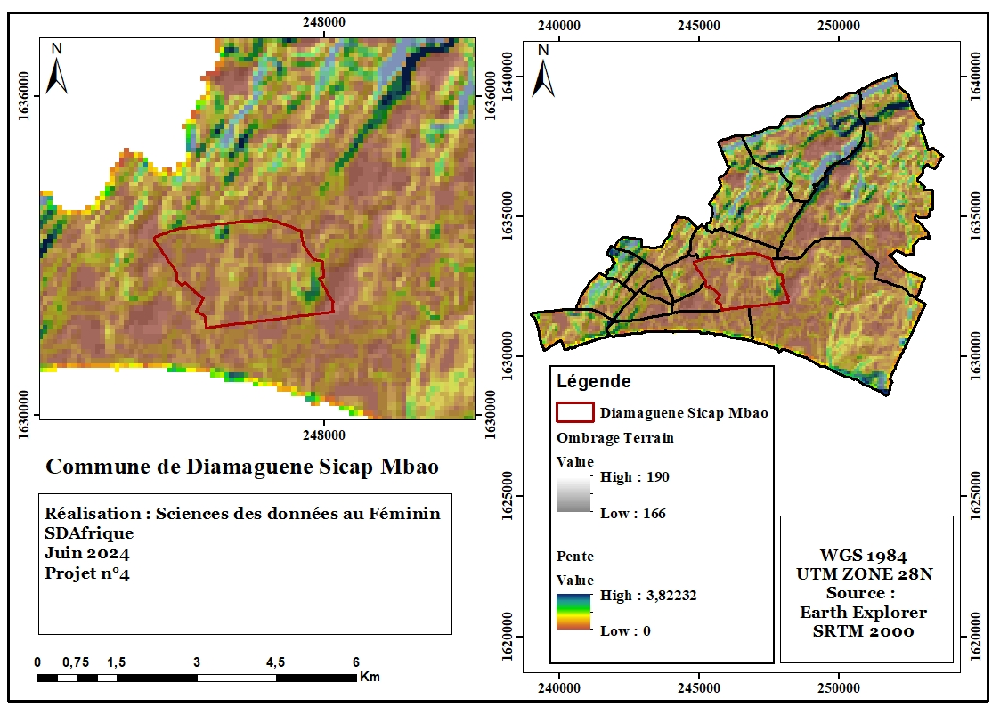
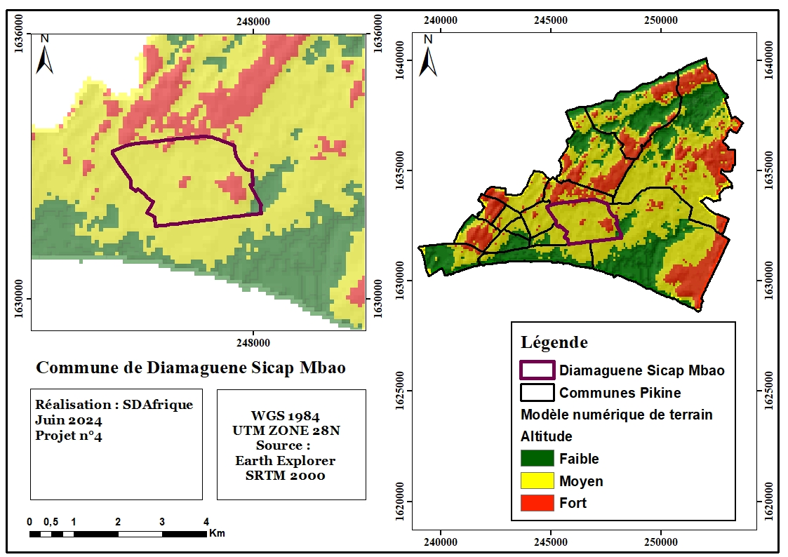

```{r setup, include=FALSE}
knitr::opts_chunk$set(echo = FALSE,message = FALSE, warning = FALSE)
```

```{r}
# Chargement des packages utilisés
library(sf)
library(sp)
library(leaflet)
library(viridis)
library(raster)
library(stars)
library(ggplot2)
library(terra)
library(rmarkdown)
library(jpeg)
library(ggthemes)
library(readxl)
```


# Contexte et justification #

Dans un monde en pleine transformation, où le dérèglement climatique s'accentue, les inondations deviennent de plus en plus préoccupantes, représentant un défi majeur pour les décideurs. La croissance démographique dans les grandes villes aggrave ce problème, avec un afflux constant de personnes s'installant en milieu urbain, entraînant une expansion rapide des quartiers périphériques. Cette urbanisation, souvent non encadrée, s'accompagne d'une carence ou d'une absence flagrante de systèmes d'assainissement pluvial, exacerbant ainsi les risques d'inondation. Conscients de ces enjeux et des difficultés rencontrées par les populations, cette étude vise à analyser les facteurs physiques et humains qui influencent directement l'ampleur des inondations, en s'appuyant sur des données géospatiales. Les inondations constituent un phénomène récurrent dans les grandes villes africaines, en particulier dans les zones périphériques, ce qui justifie le choix de la commune de Diamaguène Sicap Mbao comme zone d'étude. Cette analyse est cruciale pour permettre aux acteurs locaux d'intervenir de manière plus efficace auprès des populations confrontées aux problèmes liés aux inondations.


## Présentation de la zone d'étude ##

La commune de Diamaguène Sicap Mbao est située dans le département de Pikine, dans la région de Dakar. Elle est traversée d’ouest en est par la route nationale n°1. Elle est limitée au nord par la voie ferrée, au sud par la commune de Thiaroye-sur-Mer, et à son extrême est par la forêt classée de Mbao. Elle est séparée de l’océan Atlantique par la route nationale et la zone franche industrielle, ce qui explique son relief extrêmement bas.

La commune de Diamaguène Sicap Mbao s’étend sur une superficie de 7,3 km² et compte une population de 139 376 habitants en 2023, répartis entre 71 923 hommes et 67 453 femmes. Sa densité de population, très élevée, est de 19 092 habitants/km², témoignant du surpeuplement de cette commune, qui constitue un véritable dortoir urbain.


```{r}
#Ajout de la limite de la zone d'etude
zone_etude<- st_read("Data/DSM.shp", quiet = TRUE)
#Reprojection en degree minite seconde
zone_etude1<-st_transform(zone_etude,crs = 4326)
```

```{r}
#Visualisation de la zone d'etude

leaflet(zone_etude1)%>%
  addProviderTiles(providers$OpenStreetMap)%>%
  addPolygons(
              fillOpacity = 0,
              weight = 5)%>%
  setView(lng = -17.35297232009253, lat = 14.758706893238436, zoom = 13)
```

```{r}
Commune_pop <- read_excel("C:/Users/KHADY MAME DIARRA/Desktop/SDA/Projet/myrepo/Data/Commune_pop.xls")
ggplot(data = Commune_pop, aes(x = POPULATION, y = COMMUNE)) + 
  geom_bar(stat = "identity", width = 0.5, position = "dodge",fill="blue") + 
  xlab("Communes de Pikine") +
  ylab("Population")  +
  labs(fill = "Isic Code")  +  
  theme_minimal() + 
  scale_fill_brewer(direction = -1)
```


<div class="width-container">
  <div>

  </div>
  
  <div>

  </div>
  
</div>


# Brève Présentation du projet #
Ce projet s'inscrit dans le cadre de la gestion participative des citoyens face aux problématiques rencontrées par les populations. Sa mission principale est d'utiliser différentes sources de données géospatiales pour réaliser des analyses basées sur les sciences des données, dans le but d'apporter un soutien aux autorités locales pour la gestion des inondations dans la commune de Diamaguène Sicap Mbao.
Ce projet fait également partie de l'initiative FOI (Focus 0 Inondation), lancée par de jeunes citoyens sénégalais.

# Objectif du projet #

## Objectif général ##

**L’objectif générale de cette étude est de faire une
analyse des zones susceptibles d’être inondées grâce à l’utilisation du modèle
numérique de terrain et de la collecte des points d’eau**

## Objectif spécifique ##
- *Analyse des facteurs physiques du milieu : la topographie, pédologique et l’hydrologiques*
- *Mise en place d'une plateforme pour la collecte des zones inondées*


# Méthodologie #

## Outils et techniques de collecte des données ##
### outils utilisés ###
Les outils utilisés pour la collecte des données sont essentiellement :
-*GPS*
-*Google Earth Engine*
-**Application de collecte des données**
Afin de faciliter la collecte des données, une application de collecte sera créée pour permettre au utilisateurs et aux acteurs intéréssés par la problématique des inondations de pouvoir renseigner la localisation des zones inondées au niveau de la commune. Ceci dans le but d'avoir plus facilement l'inventaire des zones inondées.


### Technique de collecte ###
-*Terrain*
-*Téléchargement via internet*


## Méthodologie de Collecte des données ##
La collecte des données s'est essentiellement effectuée en trois phases :<br>
**Collecte des données terrain à l'aide du GPS** <br>
Le GPS (Global Positioning System) est une technologie avancée qui capte le signal des satellites afin de fournir un positionnement précis. Ces positions permettent de déterminer les coordonnées de latitude et de longitude des points d'eau, fournissant ainsi la localisation exacte des zones inondées.<br>
**Collecte des données satellitaires**<br>
Les données, telles que le modèle numérique de terrain avec une résolution spatiale de 30m et la limite de la zone d'étude, ont été téléchargées sur Google Earth Engine, une plateforme d'analyse de données géospatiales développée par Google et basée sur le cloud.<br>
**Données démographiques**<br>
Les données démographiques ont été fournies par l'Agence nationale de la statistique et de la démographie.Ces données montre le détail sur la population ainsi que son évolution dans le temps


## Méthodologie de Traitement des données ##
Le traitement des données est essentiellement réalisé avec le langage R. Cependant, il est aussi important de noter que les données brutes de localisation des zones inondées ont été prétraitées avec un logiciel SIG, ArcGIS, afin d'obtenir les données au format SHP.
Les packages utilisés sont principalement des packages géospatiaux : <br>
**Pour le traitement des données vecteurs**<br>
-*Sf*<br>
-*Sp* <br>
**Pour le traitement des données Raster **<br>
-*Raster*<br>
-*Terra*<br>


## Analyse et visualisation des données ##
L'analyse des données a été réalisée sur R en utilisant le modèle numérique de terrain. À partir des pixels extraits, une reclassification du terrain a été effectuée, divisant ce dernier en différentes sections basées sur les hauteurs. Ainsi fait le terrain a été divisé en quatres (zone) : <br>
- *zone basse * <br>
- *zone moyennement basse* <br>
- *zone haute * <br>
- *zone très haute* <br>

Basant également de la localisation des zones inondées et non inondées, une régression logistique réalisée a permis de départager la zone suivant une classification binaire.Cette méthode affecte la valeur 0 pour les zones non inondées et 1 pour les zones inondées.


# Présentation des résultats d'analyse des données #

## Format de présentation des résultats ##
Dans le cadre du projet, deux types de fichiers sont prévus pour la présentation des résultats de notre travail. :<br>
- **Rapport scientifique **<br>
Ce rapport présente les différentes étapes, allant de la collecte au traitement et à l'analyse des données, pour atteindre les objectifs fixés. Il fournit également une présentation de l'interface de collecte des données.<br>
- **Application de collecte des données**<br>
Il est également prévu un rendu sous forme d'application pour la collecte des zones inondées.


## Résultats du traitement des données ##

### Analyse de la topographie de la zone d'étude ###
- **Exploitation du Modèle numérique de terrain ** <br>
Le modèle numérique de terrain représente les élévations du sol sans tenir compte des constructions, de la végétation, des routes, des plans d'eau, etc. C'est une description numérique de la forme de la surface terrestre.Dans le cadre de cette étude, il a permis de modéliser les différentes élévaltions du terrain.<br>
-*Ajout du mnt de la région*<br>
-*Extraction de la commune de DSM*<br>
-*Visualisation du mnt de la commune DSM*<br>

<div class="width-container">
  <div>
```{r}
#Ajout du MNT de la region de Dakar
mnt<-raster("Data/Mnt_Dk.tif")
plot(mnt)
title("Modèle Numérique de Terrain de la région de Dakar")
```
  </div>
  <div>
```{r}
#Ajouter la limite de la zone d'etude
zone_DSM<-st_read("Data/DSM.shp",quiet=TRUE)
# Travailler avec le cadran de la zone d'étude
cadran_DSM<-st_read("Data/Polygone_DSM.shp",quiet=TRUE)
mnt_cadran<-mask(mnt,cadran_DSM)
# Convertir le raster en data.frame pour ggplot
mnt_cadran_frame <- as.data.frame(rasterToPoints(mnt_cadran))
colnames(mnt_cadran_frame) <- c("x", "y", "elevation")

#Reclassification de la légende en catégorie
seuil0<-2
seuil1<-6
seuil2<-8
seuil3<-10
mnt_cadran_frame$elevation_cut<-cut(
  mnt_cadran_frame$elevation,
  breaks=c(-Inf,seuil0,seuil1,seuil2,Inf),
  labels=c("très basse", "basse", "moyennement basse", "haute")
)
# Création du plot
ggplot() +
  geom_tile(data = mnt_cadran_frame, aes(x = x, y = y, fill = elevation_cut)) +
  geom_sf(data = zone_DSM, fill = NA, color = "red", size = 2) +  
  scale_fill_manual(
    values = c("très basse"="#440154FF", "basse"="#3B528BFF", "moyennement basse"="#21908CFF", "haute"="#5DC863FF"),name="Elévations"
  ) +
  theme_minimal() +
  coord_sf()  

```
  </div>
</div>

Dans la commune de Diamaguene Sicap Mbao l'élévation du terrain varie de 0 et 12 m par rapport au niveau de la mer.<br>


-**Apperçue d'un modèle numérique de terrain**<br>
-*Extraction de la valeur des pixels*<br>
```{r}
#Explication d'un MNT
mnt_DSM<-crop(mnt,cadran_DSM)
par(mfrow = c(2, 2))
par(mar = rep(1, 4))
tif<-mnt_DSM
image(tif, main = "(a)")
set.seed(131)
pts <- st_sample(st_as_sfc(st_bbox(tif)), 3)
plot(st_buffer(pts, 200), add = TRUE, pch = 3, border = 'blue', col = NA, lwd = 2)
```
<br>
Dans un modèle numérique de terrain chaque pixel contient une valeur numérique contenant l'altitude du terrain et les coordonnées géographiques. La taille du pixel représente la résolution spatiale de modèle qui est égale à 30m dans le cadre de cette étude.   


```{r}
# Créer un dataframe avec les valeurs extraites
value_pixel<-getValues(tif)
#print(value_pixel)
df_pixels <- data.frame(matrix(value_pixel[1:50], nrow = 5, byrow = TRUE))
# Afficher les 5 premières lignes du tif
print(df_pixels)

```
Une extraction de la valeur des pixels ainsi que la conversion en dataframe permet de connaitre les diiérentes élévations stockées dans chaque pixel.


-**Reclassification des élévations suivant les points collectés**
<div class="width-container">
  <div>
```{r}
#Ajout des points inondes
point_inond<-st_read("Data/Points_d'eau_DSM.shp",quiet=TRUE)
plot(point_inond)
```
  </div>
  <div>
```{r}
#Ajout des points non inondes
point_non_inond<-st_read("C:/Users/KHADY MAME DIARRA/Desktop/Local/Local_traitement/Data/Point_Alt.shp", quiet=TRUE)
plot(st_geometry(point_non_inond))
```
  </div>
</div>
Des points collectées sur les parties inondées et non inondées avec un total de 69 points, 24  points sur les zones non inondées et 45 points sur les zones inondées.<br>

Une extraction de la valeur de ces pixels montre que la valeur des zones inondées varie entre 5,6, 7 et 8 m d'élévation tandisque les zones non inondables sont entre les altitudes 8 et 12m d'élévation


```{r}
point_inond<-st_transform(point_inond,crs = 32628)
inondables <- extract(tif, point_inond)
inondables

```

```{r}
non_inondables<-st_transform(point_non_inond,crs = 32628)
non_inondables<-extract(tif, point_non_inond)
non_inondables
```
<div class="width-container"> 
  <div>
-*Visualisation des données d'analyse du mnt*

```{r}
#Convertir en Dataframe
data_inond<-as.data.frame(inondables)
data_non_inond<-as.data.frame(non_inondables)
```


```{r}
#compter le nombre des pixels d'enregistrement
nombre_inond<-table(data_inond$inondables)
#Convertir en dataframe
nombre_inond<-as.data.frame(nombre_inond)
colnames(nombre_inond) <- c("Valeur", "Nombre")
#visualiser le résultat
ggplot(nombre_inond, aes(x = Valeur, y = Nombre)) +
  geom_bar(stat = "identity", fill = "skyblue") +
  labs(title = "Distribution selon la valeur des pixels des zones inondées",
       x = "Valeur du pixel",
       y = "Nombre de pixels") +
  theme_minimal()
```
  </div>
  <div>
```{r}
#compter le nombre des pixels d'enregistrement
nombre_non_inond<-table(data_non_inond$non_inondables)
#Convertir en dataframe
nombre_non_inond<-as.data.frame(nombre_non_inond)
colnames(nombre_non_inond) <- c("Valeur", "Nombre")
#visualiser le résultat
ggplot(nombre_non_inond, aes(x = Valeur, y = Nombre)) +
  geom_bar(stat = "identity", fill = "#40e0d0") +
  labs(title = "Distribution selon la valeur des pixels",
       x = "Valeur du pixel",
       y = "Nombre de pixels") +
  theme_minimal()
```
  </div>
</div>

### Modéle de Classification ###
#### *Technique de Reclassification du Terrain* ####


```{r}
#Methode de reclassification du terrain
mnt<-mnt_DSM
mnt[mnt <= 2] <- 0
mnt[mnt > 2 & mnt <= 4] <- 1
mnt[mnt > 4 & mnt <= 8] <- 2
mnt[mnt > 8] <- 3
plot(mnt)
title("Reclassification Terrain selon les hauteurs")
```

#### *Modèle de regression logistique* ####
```{r}

```

Une reclassification du modèle numérique de terrain et l'application de la classification binaire par la technique de regression logistique montre que l'élévation du terrain uniquement ne suffit pas pour justifier qu'une zone soit inondable ou pas. Donc il est essentielle de prendre en compte d'autres paramètres liés aux : <br>
-**Type de sol**<br>
-**L'accumulation des flux du réseau hydrographique**<br>
-**La couverture réseau en assainissement d'eau pluviale**<br>
Qui sont tous des éléments fondamentaux dans l'explication des problèmes liés à l'inondation


###  Facteurs Complémentaires ###
#### Type de sol ####
```{r}
Type_sol<-st_read("Data/Sol.shx",quiet=TRUE)
```


```{r}
ggplot(data=Type_sol)+
  geom_sf(aes(fill = Name))+
  scale_fill_manual(values = c("orange", "skyblue"),
                    name = "Types de Sol")+
  labs(title = "Les types de sol de la Commune de DSM")+
  theme_minimal()+
  theme(legend.position = "bottom",
        legend.background = element_rect(fill = "grey", color = "black"),  # 
        legend.title = element_text(size = 12),
        legend.text = element_text(size = 12))
```
```{r}
#typesols
x<-c("Sols ferrugineux tropicaux faiblement lessivés","Sols hydromorphes")
y<-c(7.15,1.92)
Sol_area<-data.frame(Type_de_sol=x,Surface=y)
print(Sol_area)
```
La plus grande partie des sols de la commune de Diamaguene Sicap Mbao est constituée de sol ferrugineux tropicaux faiblement lessivés à environ 86% de la surface de la commune. C'est type de sol, grâce à leurs structure granuleuse permettent une infiltration de l'eau. Cependant en cas de forte pluviométrie les sols peuvent se saturer réduisant la vitesse d'infiltration et favorisant ainsi une accumulation des flux.<br>

Les sols hydromorphes quant à eux par leur nature saturée sont particulièrement très sensibles aux inondations.

#### Accumulation des flux ####

#### Couverture réseau assainissement ####


# Présentation de la plateforme de collecte des données #


# Conclusion et Perspective #

# Difficultés Rencontrées et Solutions Employées #
-**Limite du langage dans le traitement des données spatiales**
-**Difficultés d'obtenir certaines données sur la couverture du réseau d'assainissement**
